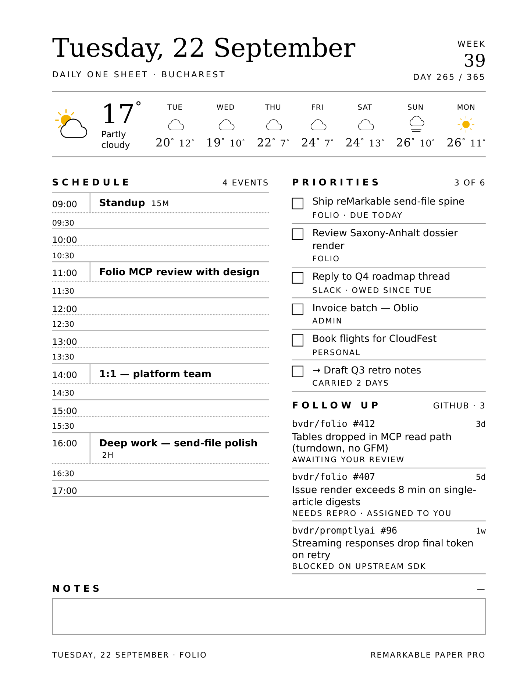
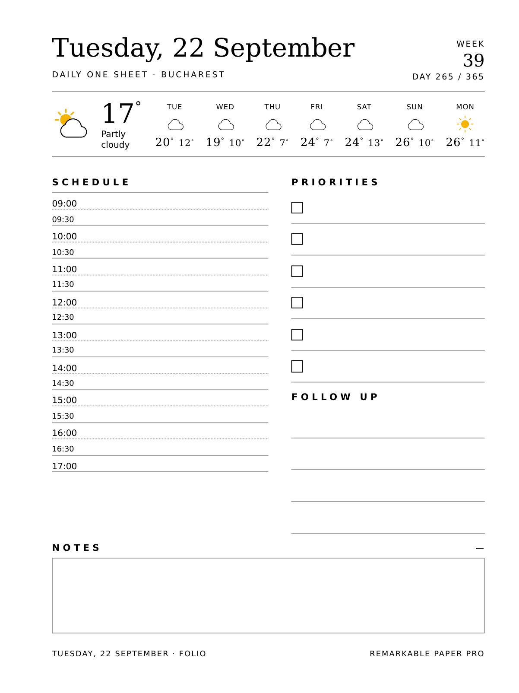
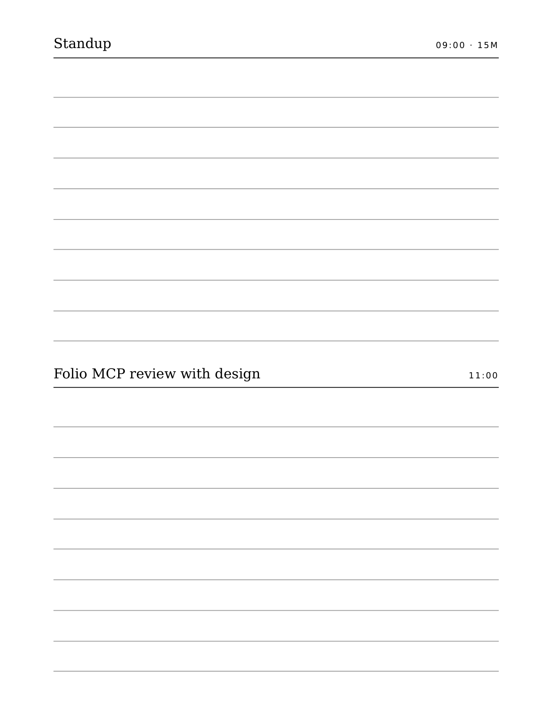

<div align="center">

# 🗓️ Daily Planner for reMarkable

**A Claude skill that builds a beautiful, e-ink–optimized daily one-sheet and sends it straight to your tablet with [Folio](https://myfolio.so).**

It interviews you, pulls from your connected tools, fills in today's weather, and renders a print-exact PDF for your device.



<sub>Rendered at the exact reMarkable Paper Pro page size (179.7 × 239.5 mm). Dummy content shown.</sub>

[](https://github.com/bvdr/daily-planner-skill-remarkable)
[](https://myfolio.so)


</div>

---

## ✨ What it does

- **📤 Delivers via Folio** — picks the device connected in your Folio account and sends the finished PDF. Prompts you to install the Folio MCP (`myfolio.so/mcp`) if it's missing.
- **📐 Knows your device** — reMarkable Paper Pro / rM2, Kindle Scribe, Supernote A5X / Nomad, Kindle. Uses the live render spec from Folio when available, built-in profiles otherwise. Keeps the tool-rail side clear so the toolbar never covers your plan.
- **📍 Fills in the context** — today's date, ISO week + day-of-year, your location, and live weather (current + a 7-day outlook with icons).
- **🧩 Modular** — pick your sections: schedule, priorities, follow-ups, notes, plus top-3, habit tracker, time-block grid, water, meals, workout, gratitude, your Folio reading queue, and more.
- **🗒️ Meeting pages** — every meeting on your schedule gets its own half-page ruled notes section, two per page.
- **🖊️ Built to be written on** — pure-black text, 30–40% form lines, whole-pixel strokes, no hairlines, greys, or gradients. It reads perfectly on e-ink.
- **♻️ Reproducible from data** — the whole sheet is generated from one JSON file, so any day can be rebuilt from live data.

## 🖼️ More looks

| Blank template (write-on) | Per-meeting notes |
| :---: | :---: |
|  |  |

## 🚀 Install

Add the marketplace in Claude Code, then install the plugin:

```
/plugin marketplace add bvdr/daily-planner-skill-remarkable
/plugin install daily-planner
```

You'll also need the **Folio MCP** for delivery: <https://myfolio.so/mcp>

> Rendering uses headless Chrome/Chromium (already on most machines) and falls back to WeasyPrint. No browser and no Python? The skill can still assemble and render the sheet — see [SKILL.md](plugins/daily-planner/skills/daily-planner/SKILL.md).

## 💬 Use

Just ask Claude:

> **make my daily plan and send it to my reMarkable**

The skill figures out your location, checks the weather, asks what to include, builds the sheet, and delivers it. It names the file the Folio way: `DD.MM.YYYY - Daily Plan - <Device>.pdf`.

## 📱 Supported devices

| Device | Page size | Notes |
| --- | --- | --- |
| reMarkable Paper Pro | 179.7 × 239.5 mm | Colour weather icons, left tool-rail margin |
| reMarkable 2 | 157.3 × 210.4 mm | Greyscale |
| Kindle Scribe | 157.5 × 210.0 mm | No side rail |
| Supernote A5X / Manta | 157.8 × 210.4 mm | Delivered via Dropbox / Drive |
| Supernote A6X2 Nomad | 118 × 157 mm | Compact, fewer modules |
| Kindle (Paperwhite) | 107 × 142 mm | Reader-size |

Folio-connected devices deliver directly; the rest go via Dropbox / Google Drive.

## 🛠️ How it works

```
data (date · location · weather · schedule · tasks)
        │
        ▼
build_sheet.py  ──►  HTML + planner.css        (all design decisions baked in)
        │
        ▼
render.py       ──►  print-exact PDF           (headless Chrome, WeasyPrint fallback)
        │
        ▼
Folio MCP       ──►  your reMarkable / Kindle / Supernote
```

Everything lives in [`plugins/daily-planner/skills/daily-planner/`](plugins/daily-planner/skills/daily-planner):

```
SKILL.md                     the workflow Claude follows
scripts/build_sheet.py       data (JSON) -> sheet HTML
scripts/render.py            HTML -> print-exact PDF
reference/example-data.json  a full working data file to copy
reference/devices.json       e-ink device profiles
reference/modules.md         module catalogue + markup
assets/planner.css           the e-ink stylesheet
assets/weather-icons.md      8 weather icons (colour on colour devices)
```

## 🔁 Rebuild any day yourself

```bash
cd plugins/daily-planner/skills/daily-planner
# edit a copy of reference/example-data.json with today's data, then:
python3 scripts/build_sheet.py my-day.json day.html
python3 scripts/render.py day.html "22.09.2026 - Daily Plan - reMarkable Paper Pro.pdf" 179.7 239.5
```

## 📄 License

MIT © [Bogdan Dragomir](https://github.com/bvdr)
